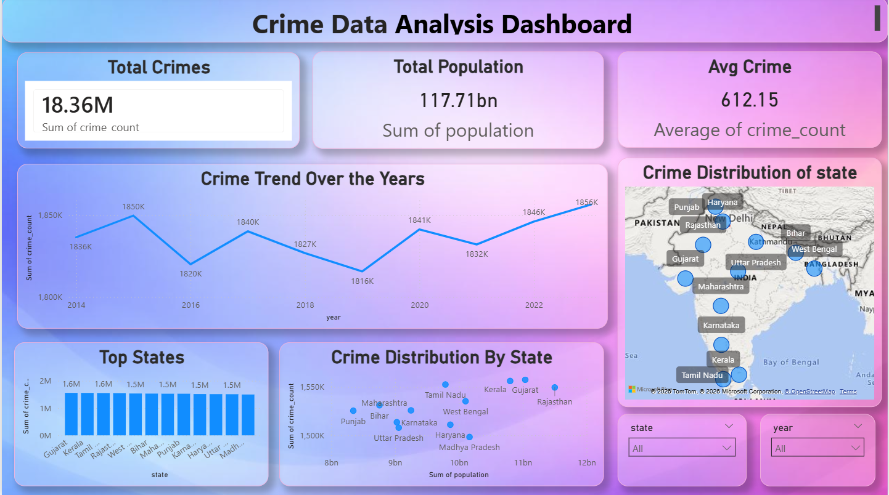

##  Crime Data Analysis Project

This project analyzes crime data using Python, PostgreSQL, SQL Queries, and Power BI Dashboard.

##  Tools Used
- Python (Pandas, NumPy)
- PostgreSQL
- Power BI
- Jupyter Notebook

##  Key Insights
- Crime trend over the years
- Top crime states
- Population vs Crime relationship
- Interactive dashboard filtering

##  Dashboard Preview

##  Files Included
- 107_crime_python.ipynb → Python cleaning & analysis
- crime_project_db.sql → SQL queries
- crime_project_db.pbix → Power BI dashboard
- crime_project_report.pdf → Final report

##  Conclusion
This project helps understand crime patterns and supports better decision making using data analytics.

## Created By
Mansi Vishve
